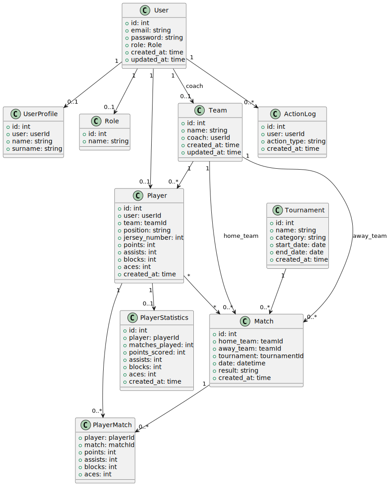

# Проект: Система управления волейбольными турнирами

## Автор
ФИО: Авдошко Иван Сергеевич  
Группа: 253505

## Описание проекта
Данный проект представляет собой систему управления турнирами по волейболу. В системе реализована возможность управления пользователями, командами, игроками, а также проведения турниров и отслеживания статистики матчей и игроков.

## Функциональные требования

1. **Авторизация/аутентификация пользователя**  
   Система позволяет пользователям регистрироваться и входить в систему с помощью учетных данных (email и пароль). Также предусмотрена роль администратора, который имеет доступ к управлению пользователями.

2. **Управление пользователями (CRUD)**  
   Администратор системы может создавать, редактировать, удалять и просматривать учетные записи пользователей. Пользователи могут изменять свои данные.

3. **Система ролей**  
   Система поддерживает несколько ролей пользователей (администратор, тренер, игрок), каждая из которых имеет свои права доступа и функциональность.

4. **Журналирование действий пользователя**  
   Все действия пользователей (вход, изменения данных и т.д.) записываются в журнал, что позволяет отслеживать активность и изменения в системе.

## Список таблиц для БД

1. **User**
   - id: int
   - username: string
   - email: string
   - password: string
   - role: Role
   - created_at: time
   - updated_at: time

2. **Role**
   - id: int
   - name: string

3. **Team**
   - id: int
   - name: string
   - coach: User
   - created_at: time
   - updated_at: time

4. **Player**
   - id: int
   - user: User
   - team: Team
   - position: string
   - jersey_number: int
   - points: int
   - assists: int
   - blocks: int
   - aces: int
   - created_at: time

5. **Tournament**
   - id: int
   - name: string
   - category: string
   - start_date: date
   - end_date: date
   - created_at: time

6. **Match**
   - id: int
   - home_team: Team
   - away_team: Team
   - tournament: Tournament
   - date: datetime
   - result: string
   - created_at: time

7. **PlayerMatch**
   - player: Player
   - match: Match
   - points: int
   - assists: int
   - blocks: int
   - aces: int

8. **PlayerStatistics**
   - id: int
   - player: Player
   - matches_played: int
   - points_scored: int
   - assists: int
   - blocks: int
   - aces: int
   - created_at: time

9. **ActionLog**
   - id: int
   - user: User
   - action_type: string
   - created_at: time

10. **UserProfile**
    - id: int
    - user: userId
    - name: string
    - surname: string
    
## Ненормализованная инфологическая модель БД

